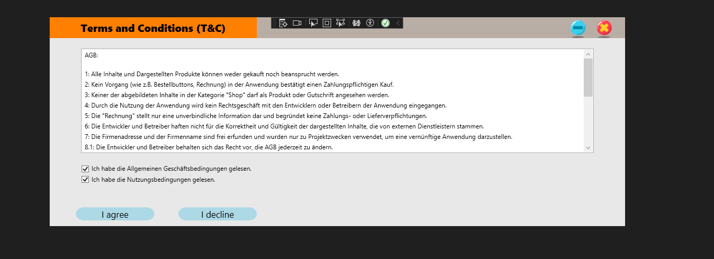
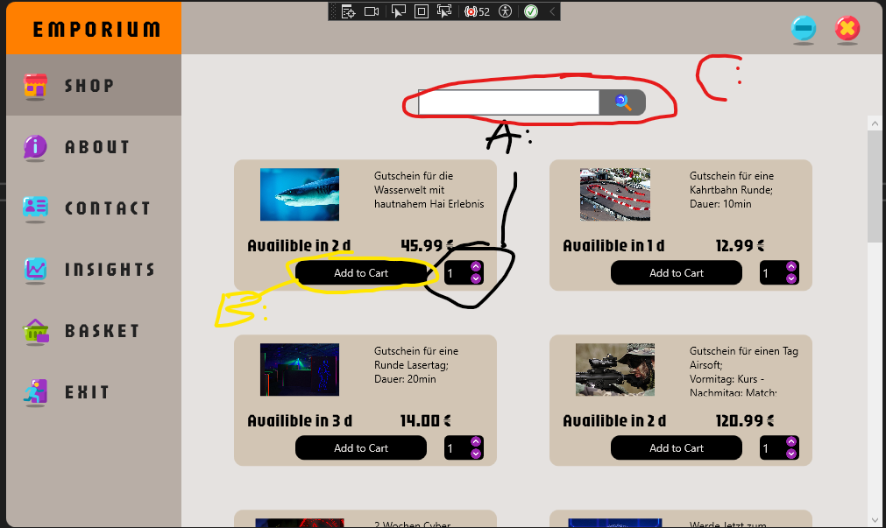
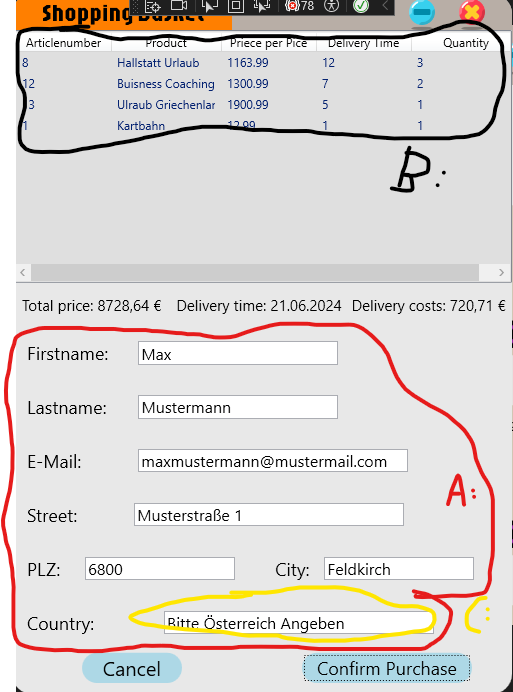
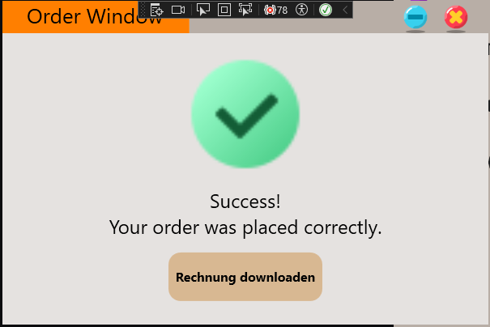

# Umsetzungsdetails

## Welche Softwarevoraussetzungen werden benötigt (mit Versionen):
- Zielframework: .NET 8.0
- Aspose PDF (24.5.1)
- Document.Format.OpenXml (3.0.2)
- LiveCharts.Wpf (0.9.7)
- MySql.Data (8.4.0)
- Serilog (4.0.0)
- Serilog.Sinks.Console(5.0.1)
- Serilog.Sinks.File(5.0.0)
- System.Configuration.ConfigurationManager(8.0.0)
- System.Drawing.Common(8.0.6)
- System.Security.Cryptography.ProtectedData(8.0.0)
- System.Text.Encoding.CodePages(8.0.0)

## Detaillierte Beschreibung der Umsetzung:
Als erstes haben wir uns eine Idee für unser Projekt überlegt.
Daraufhin haben wir versuch die Grundbausteine für unseren Shop zu legen (UI Entwurf, Klassendiagramm).
Als nächstes haben wir die Basis Windows erstellt, also das Main Window, BasketWindow danach noch das Window_OrderConfirmation.
Dazu haben wir noch die Klassen Shoppingbasket und Product sowie Product List erstellt.
Danach haben wir den Grund UI Entwurf erstellt und diesen am Schluss auf alle Windows spezifisch angewendet und einzeln für jedes Window zugeschnitten.
Etwa kurz nach der Mitte der Zeit haben wird die Datenbanken erstellt, verbunden und die daten für die Statistiken ausgelesen.
Ebenfals haben wir das Contact sowie das About Window erstellt und am Ende das T&C Window erstellt.
Am Ende haben Wir noch alles geloggt und die Designs überarbeitet, sowie das PDF verbessert und vollfunktionsfähig gemacht.

## Probleme und ihre Lösungen:
- Max:
    - PDF Window:
        - Problem: Lange gebraucht bis ein Nuggetpackage funktioniert hat und bis ich dann die Funktionen alle beherscht habe.
        - Lösung: Testen verschiedener NuggetPackages bis eines funktioniert hat.
    - MySQL Connection:
        - Problem: Es hat keine korrekte Verbindung aufbauen können
        - Lösung: Richtige Positionierung Daten im string also (IP,Port usw.)
- Valentin:
    - Problem: Checken ob ein Button in einem CustomControl geklickt wurde und darauf reagieren in dem Fenster.
    - Lösung: Eine Methode in dem Fenster und dann wenn Button geklickt wird Invoke im CustomControl den Wert setzen.
## Wie wurde die Software getestet:
- Einzel Test:
    - Jeder Teil wurde Einzelned getestet und überprüft
    - verschiedenste Variationen wie z.B. PLZ auslassen und alles andere befüllen und schauen was passiert (es steht da: PLZ Format: 0000) und dann muss man es richtig eintragen
    - Bei T&Cs Akzeptieren klicken versucht man nur eines zu Akzeptieren und das geht nicht
- Multi Check:
    - Als ganze Anwendung testen (Agreements Accept --> Produkte auswählen --> Daten eingeben --> Rechnung Herunterladen)
- Personencheck:
    - mehrer Leute haben die Anwendung ausführlich getestet.

#
#
#

## Bedienungs Anleitung:
Sehr geehrter Kunde:
Hier gibt es ein ausführliche Anleitung für die Benutzung unseres High-End Shops.
Bitte starte Die Anwendung.
Beachte Folgende Schritte:
- T&C:
    - Beide Checkboxen anklicken
    - Klick: I agree
    - Klick: i decline (wenn du es ablehnst)

- Klicke das An was du möchtest im Hauptfenster:
    - Shop
        - Wähle dort die Produkte aus
    - About
        - Dort siehst du Infos über unser Unternehmen
    - Contact
        - Kontaktinformation (Impressum)
    - Insights
        - Dort Sind Beide Statistiken enthalten:
            - Beim Klick auf Insights öffnet sich das erste.
            - Dann Klicke auf X in der Ersten Statistik.
            - Dann öffnen sich die Zweite.
    - Basket
        - Dort Sie die Produkte enthalten die du in den Warenkorb hinzugefügt hast.
        - Du musst auch deine Konsumenteninformationen dort eintragen und dann auf "Zahlungspflichtig bestellen klicken".
    - Exit
        - Es beendet den Shop
- Produkte auswählen
    - Du kannst scrollen oder Suchen mithilfe der Suchleiste
        - A: Man gibt z.B. "Las" ein, dann gibt es "Lasertag" unter der Leiste als Vorschlag aus und dann klickt man auf Lasertag Vorschlag und drückt auf das Suchzeichen --> Es zeigt das Produkt an
            - Um es zurückzusetzen (die Ansicht), muss man "$" schreiben und auf Suchen klicken.
        - B: Fügt das Produkt mit der Ausgewählte anzahl hinzu
        - C: Dort wählt man die die Anzahl des ausgewählten Produkts aus
        

- Basket
    - A: Gib dort deine Daten ein.
    - B: Zeigt die Produkte an die du in den Warenkorb getan hast.
    - C: z.B. Land wurde flasch eingegeben - es kommt die Fehlermeldung --> dann must du den richtigen Wert eingeben also Österreich
    - Klicke "Confirm Purchase" um weiter zu gehen

- OrderConfirmation
    - Clicke Auf Rechnung Downloaden um Rechnung Herunter zu laden

- Öffne die Rechnung

## Quellen: ICON8, Pixaby

    